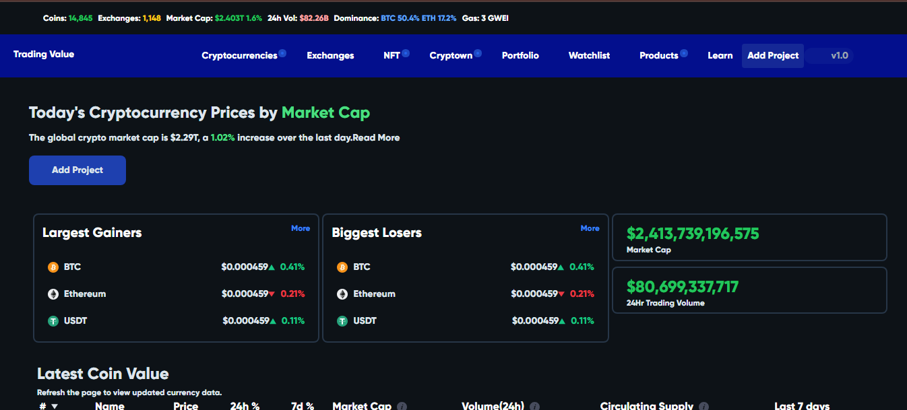
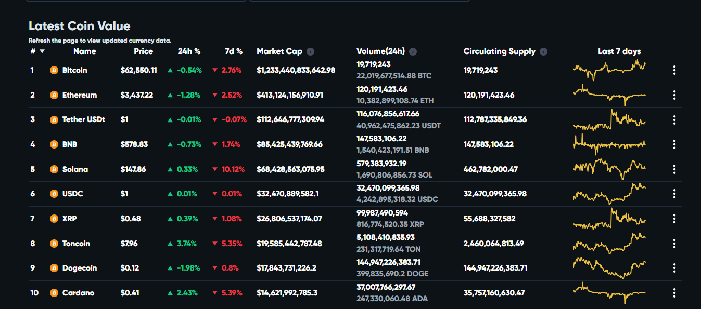

## With Web-3-Scanner

This is a tool created to allow users view various tokens from various
web-3/Crypto API Sources. This web-tool helps to easily track the volatile value of coins

### Usage and Features 🍀

- Track the value of Various Cryptocurrencies and tokens in the market
- Add/Create personal Crypto Tokens on the ethereum blockchain using the
  ERC20 Rule
- Live View Chart of all Cryptocurrencies and Tokens
  

### APIs Used

- [**Tradingview api**]
- [**Coinmarket cap**](https://coinmarketcap.com)

### Tool and Technologies Used 🔧🧰

- [Node JS](https//nodejs.org)
- [NextJS](https//nextjs.com)
- [TailwindCss](https://tailwindcss.com)
- [TypeScript](https://typescript.com)
- [Vercel](https://vercel.com)

### Live Site Url 🌐

[web-3 Scanner](https://with-web3.vercel.app)
